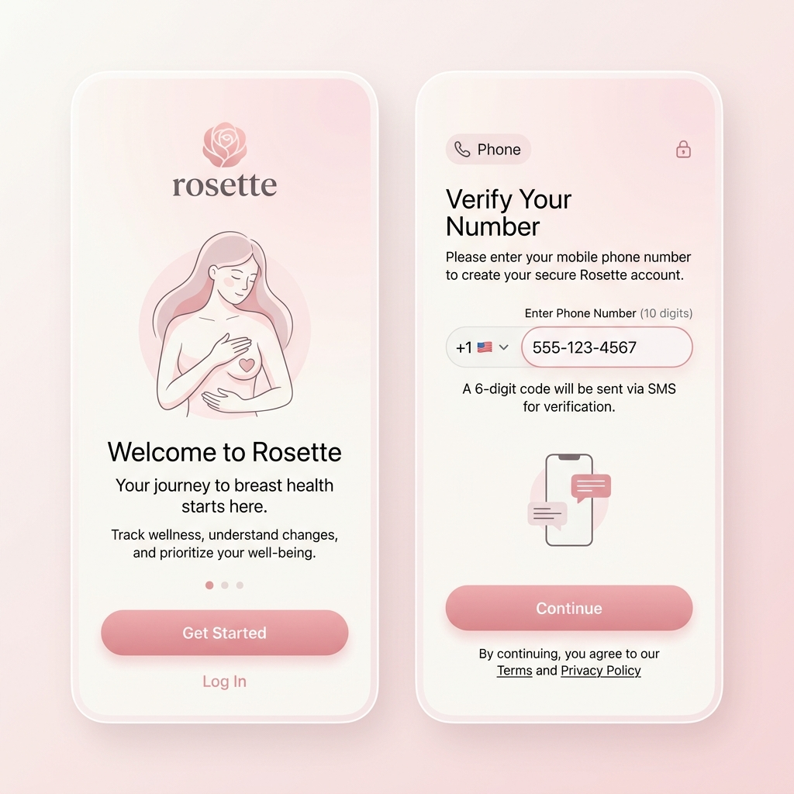
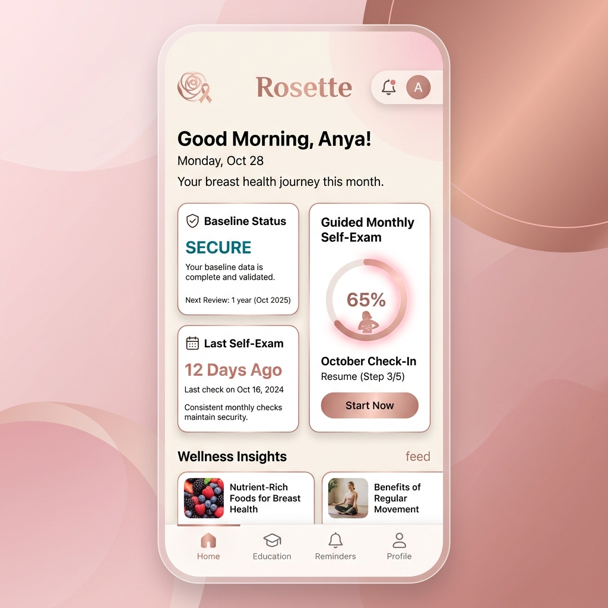
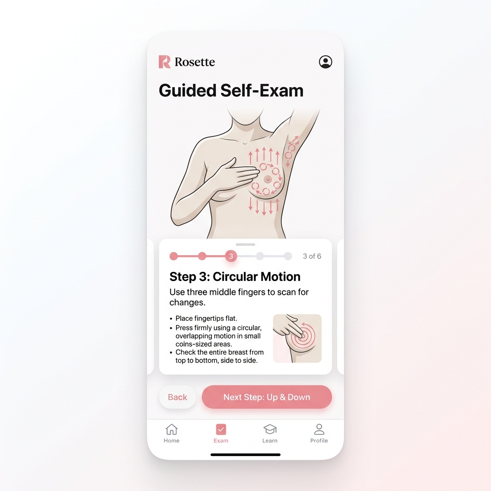
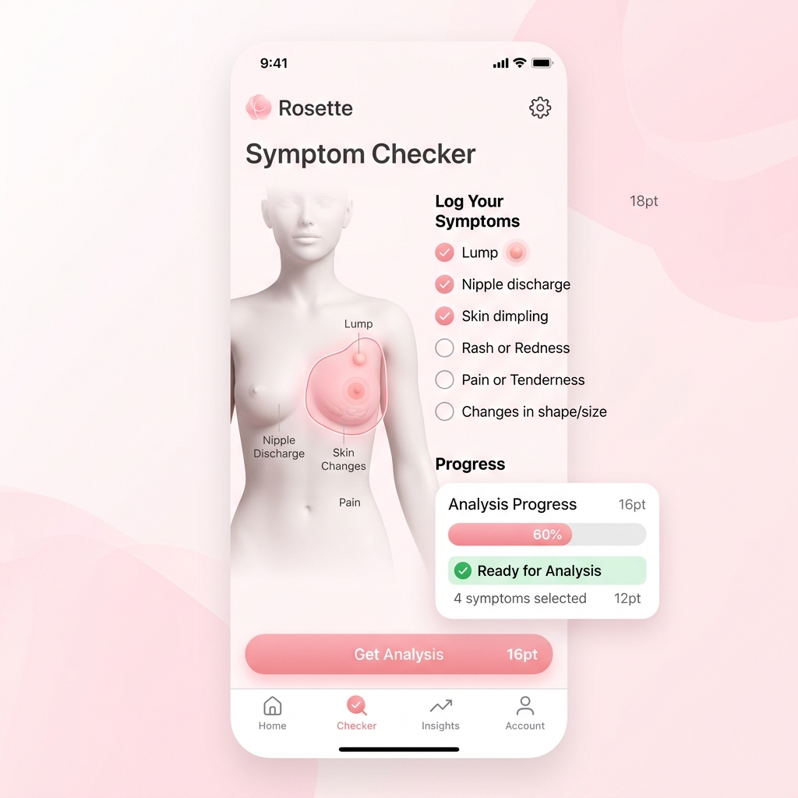
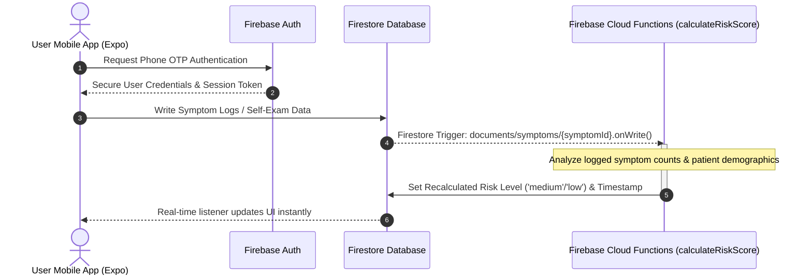
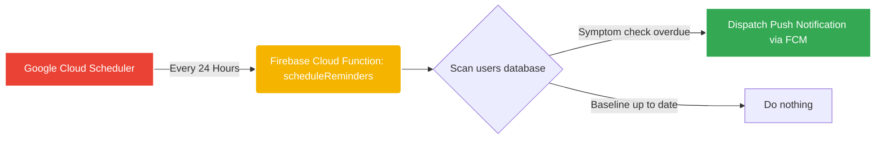

# 🌸 Rosette Mobile: AI-Powered Breast Health Companion

[](https://opensource.org/licenses/MIT)
[](https://reactnative.dev)
[](https://expo.dev)
[](https://firebase.google.com)
[](https://firebase.google.com/docs/functions)
[](https://rosette-liart.vercel.app)

👉 **[Live Vercel Web Demo](https://rosette-liart.vercel.app)**

**Rosette** is a modern, privacy-first mobile application designed to empower proactive breast health through intelligence, structured wellness rituals, and serverless risk assessments. 

By bridging the gap between clinical knowledge and everyday wellness, Rosette offers users a secure, supportive, and emotionally comforting environment for monthly self-examinations, symptom logging, and real-time risk classification.

---

## 🎗️ The Core Philosophy & Impact

### The Problem
Breast health is historically reactive. Due to anxiety, lack of structured guidance, or general discomfort, most individuals only consult a clinical expert once symptoms become advanced. 

### The Solution: Proactive Health Rituals
Rosette shifts the paradigm from reactive fear to **gentle, proactive care**. It establishes:
1. **Low-friction Onboarding:** Secure phone-only authentication (no password fatigue).
2. **Visual Step-by-Step Guidance:** Interactive visual walkthroughs of proper monthly self-exams.
3. **Structured Symptom Profiling:** Clear logging of anatomical variations (color-coded highlights).
4. **Serverless Risk Insights:** Immediate risk estimation via real-time Firebase triggers.

---

## 🖼️ Application Showcases

| Onboarding Flow | Home Dashboard | Guided Self-Exam | Symptom Checker |
| :---: | :---: | :---: | :---: |
|  |  |  |  |
| *Secure, calming onboarding* | *Dynamic status at a glance* | *Precision physical guidance* | *Interactive clinical checks* |

---

## 🏗️ Systems Architecture & Flow

Rosette is powered by a seamless serverless architecture combining **Expo (React Native)** with a real-time **Firebase backend**. The entire data propagation operates in real-time:

### Real-Time Risk Assessment Flow


### Serverless Reminder Scheduling


---

## 🛠️ Technical Stack & Frameworks

- **Cross-Platform Frontend**: [React Native](https://reactnative.dev) & [Expo Go](https://expo.dev) – Single codebase running natively on iOS, Android, and Web.
- **Serverless Backend**: [Firebase Cloud Functions](https://firebase.google.com/docs/functions) – Isolated, automatically scaled JavaScript microservices.
- **Real-Time Storage**: [Firestore Database](https://firebase.google.com/docs/firestore) – Fully managed NoSQL document database.
- **Identity Orchestration**: [Firebase Authentication](https://firebase.google.com/docs/auth) – Secure phone OTP verification.
- **Elegant Navigation**: [React Navigation](https://reactnavigation.org) – Seamless transitions between Onboarding, Dashboard, Exam, and Checker stacks.
- **Calming Design System**: Styled-system using responsive tokens tailored for high-accessibility, calming pastel tones, and modern typography.

---

## ⚡ Developer & Local Run Procedures

### Prerequisites
- [Node.js](https://nodejs.org/) (v18 or later recommended)
- [Expo Go App](https://expo.dev/expo-go) installed on your iOS/Android device.

### 1. Installation
Clone the repository and install all node packages:
```bash
git clone https://github.com/Jawknee-builds/rosette.git
cd rosette
npm install
```

### 2. Configuration & Secrets Handling
Rosette utilizes Expo's built-in support for environment variables. Create a `.env` file in the root folder for custom Firebase connections:
```env
EXPO_PUBLIC_FIREBASE_API_KEY=your_firebase_api_key
EXPO_PUBLIC_FIREBASE_AUTH_DOMAIN=your_auth_domain
EXPO_PUBLIC_FIREBASE_PROJECT_ID=your_project_id
EXPO_PUBLIC_FIREBASE_STORAGE_BUCKET=your_storage_bucket
EXPO_PUBLIC_FIREBASE_MESSAGING_SENDER_ID=your_messaging_sender_id
EXPO_PUBLIC_FIREBASE_APP_ID=your_app_id
```
> [!NOTE]
> If no variables are defined, the app gracefully falls back to secure mockup configurations (`"mock-api-key"`) so you can run the app locally without immediate cloud infrastructure setup!

### 3. Launching the App
Run the Expo development bundler:
```bash
npx expo start
```

### 4. Testing & Running on Device
- **Physical Device**: Scan the generated **QR code** in the terminal using either the Camera app (iOS) or the Expo Go app (Android).
- **iOS Simulator**: Press `i` to spin up the local iPhone simulator (requires Xcode).
- **Android Emulator**: Press `a` to spin up your Android Studio emulator.
- **Web Interface**: Press `w` to run a fully responsive web preview in your default browser.

---

## 📁 Repository Structure

```text
rosette/
├── assets/          # Calming brand logos, app icons, and stunning UI mockups
├── firebase/        # Security rules, database indexes, and Cloud Functions code
│   └── functions/   # calculateRiskScore trigger and daily notification scheduler
├── src/
│   ├── components/  # Atomic UI primitives, customized input fields, and layouts
│   ├── navigation/  # Routing hierarchies and interactive stack navigations
│   ├── screens/     # Highly polished UI screens (Auth, Onboarding, Exam, Dashboard)
│   ├── services/    # Client-side Firebase configs and push notification services
│   └── theme/       # Design tokens (curated pastel colors, typographic sizes)
├── App.js           # Root application entry point
├── app.json         # Expo package metadata and manifest config
└── vercel.json      # Client-side web hosting configurations
```

---

## 🛡️ Privacy & Compliance
All user details, symptom records, and self-exam logs are strictly scoped using **Firebase Firestore Security Rules** to ensure that users can only read or write their own documents. No health records are shared with third parties.

---
*Built with care & dedication by [Jawknee-builds](https://github.com/Jawknee-builds)*
